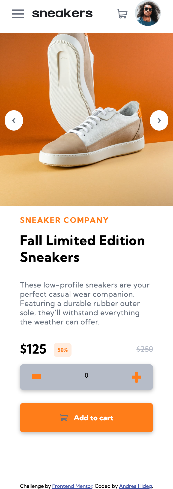
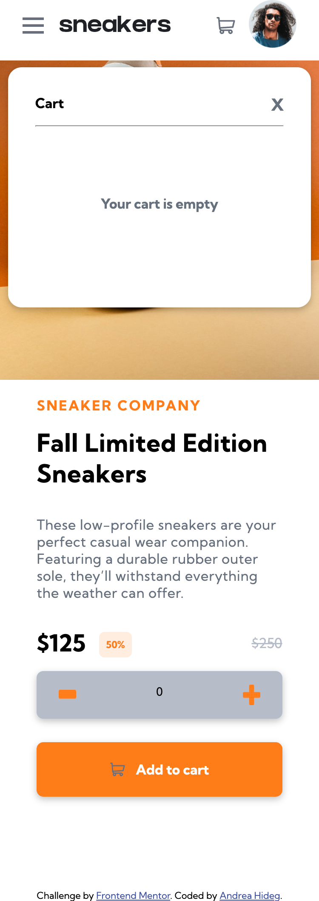
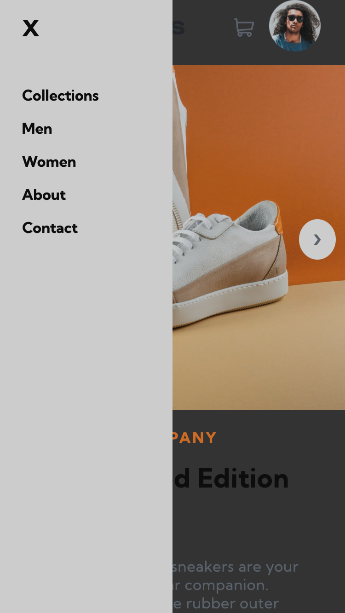
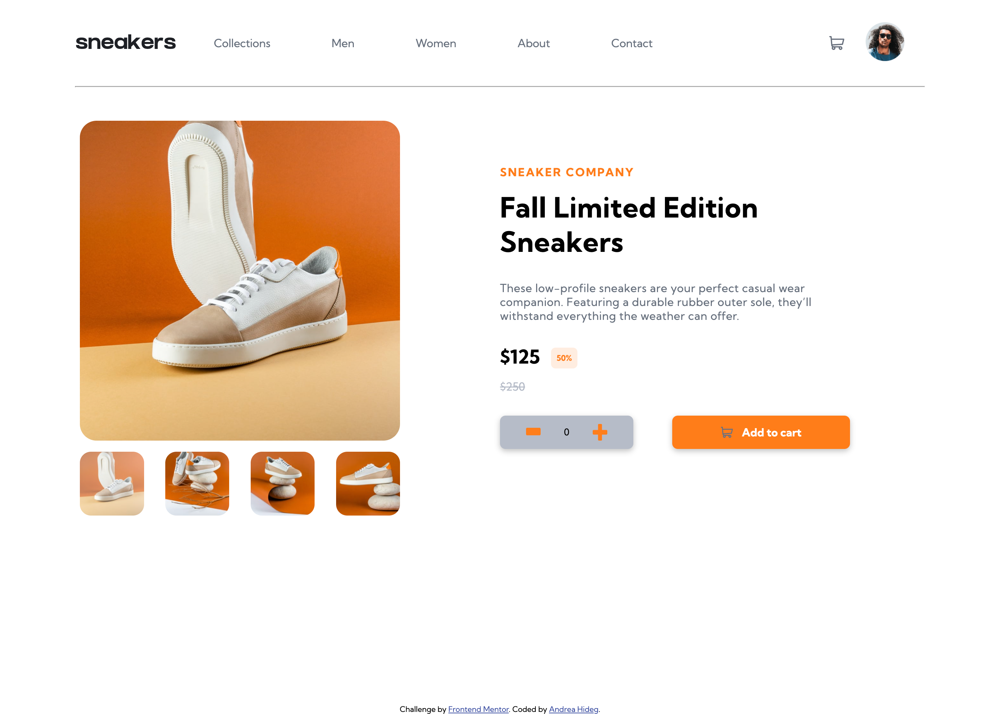
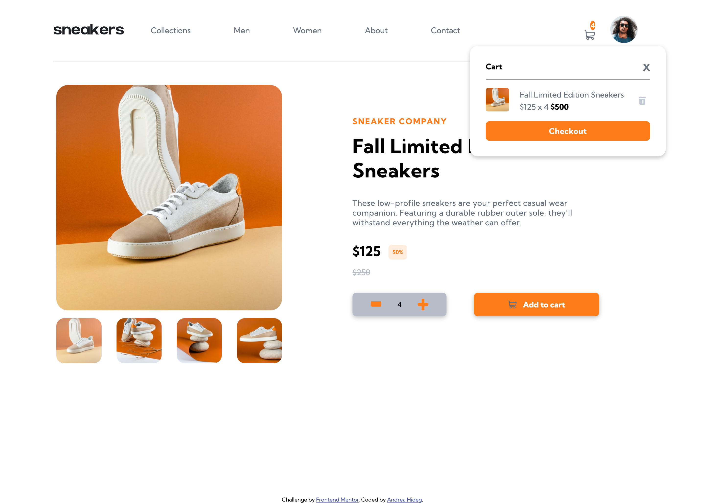
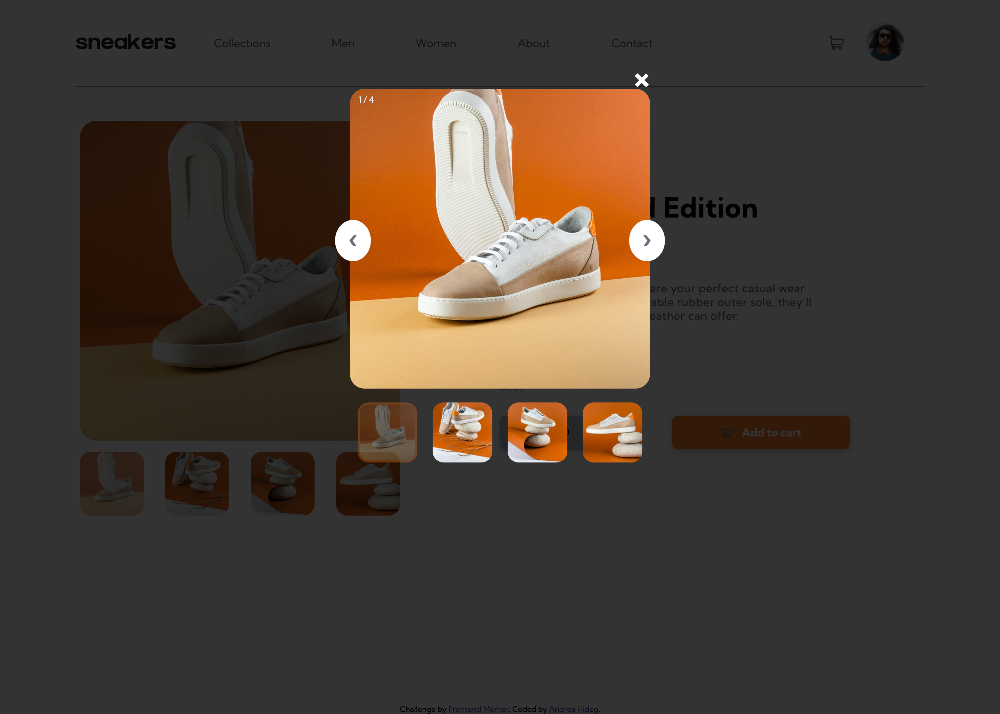

# Frontend Mentor - E-commerce product page solution

This is a solution to the [E-commerce product page challenge on Frontend Mentor](https://www.frontendmentor.io/challenges/ecommerce-product-page-UPsZ9MJp6). Frontend Mentor challenges help you improve your coding skills by building realistic projects.

## Table of contents

- [Overview](#overview)
  - [The challenge](#the-challenge)
  - [Screenshot](#screenshot)
  - [Links](#links)
- [My process](#my-process)
  - [Built with](#built-with)
  - [What I learned](#what-i-learned)
  - [Continued development](#continued-development)
  - [Useful resources](#useful-resources)
- [Author](#author)
- [Acknowledgments](#acknowledgments)

**Note: Delete this note and update the table of contents based on what sections you keep.**

## Overview

### The challenge

Users should be able to:

- View the optimal layout for the site depending on their device's screen size
- See hover states for all interactive elements on the page
- Open a lightbox gallery by clicking on the large product image
- Switch the large product image by clicking on the small thumbnail images
- Add items to the cart
- View the cart and remove items from it

### Screenshot









### Links

- Solution URL: [Add solution URL here](https://your-solution-url.com)
- Live Site URL: [Add live site URL here](https://your-live-site-url.com)

## My process

### Built with

- Semantic HTML5 markup
- CSS3
- Flexbox
- Mobile-first workflow
- Vanilla JS
- Swiper.js


### What I learned

- asynchronous Javascript. In JS File add this function so that the DOM content doesn´t load before the HTML file. Add the async attribute to the HTML element. 

```html
  <script src="app.js" async></script>
```

```js
  if (document.readyState == 'loading') {
      document.addEventListener('DOMContentLoaded', ready)
  } else {
      ready()
  } 
```


- learned creating a shopping cart. Webdev simplified YouTube channel´s tutorial: [https://www.youtube.com/watch?v=YeFzkC2awTM&t=2110s] was a great help for the basic things.

  - learned how to add items to a shopping cart
  - learned how to remove items from the shopping cart

- learned how to create a small cart icon which shows the number of items in cart  when we have an item in the shopping cart. If we don´t have anything in the shopping cart no number will be displayed

- learned how to create a lightbox from w3schools [https://www.w3schools.com/howto/howto_js_lightbox.asp] I slightly altered the code to fit my project. 

- learned how to create & customize an image slider with swiper.js [https://swiperjs.com]

- learned to apply .createElement JS method to create a new element (when adding an item to the cart). Later on it will be useful to apply this method in other projects. Example code: 

```js 
  let cartRow = document.createElement('div')
```

- learned to use classList.contain() JS method, it was especially useful to disable the cart-function on mobile devices when the hamburger menu is active:

```js
  function hideCartContent() {
      if(hamburger.classList.contains('active')) {
          cartIcon.removeEventListener('click', displayCartContent)
      } else {
          cartIcon.addEventListener('click', displayCartContent)
      }
  }
```

- learned to change background color when hamburger menu is active on mobile devices:

```js
  function changeBackground() {
    if(hamburger.classList.contains('active')) {
        body.classList.add('active');
        mainProductImage.classList.add('active');
    } else {
        body.classList.remove('active');
        mainProductImage.classList.remove('active');
    }
  }
```

- learned the importance of transform: translate in CSS in positioning elements (here especially the cart element positioning on mobile size). 

### Continued development

- Vanilla JS: methods, functions, objects
- swiper.js customization
- CSS Mobile first workflow


### Useful resources

- [w3schools how to](https://www.w3schools.com/howto/) - This helped me to understand and create a lightbox in my project.

- [Webdev Simplified Youtube tutorials](https://www.youtube.com/@WebDevSimplified) - This youtube channel is one of the best when it comes to practical examples. I watched the shopping cart tutorial and implemented the logic in my project.

- [swiper.js] (https://swiperjs.com) - I used this JS library to create an image slider for mobile screen size.

- [stackoverflow] (https://stackoverflow.com) - great source to find solutions for minor issues / general questions.

- [MDN] (https://developer.mozilla.org/en-US/)


## Author
- Frontend Mentor - [@MirrMurr](https://www.frontendmentor.io/profile/MirMurr)


## Acknowledgments

I got inspiration from Webdev Simplified YoutTube channel to create the shopping cart functionality. It was a great video, helped me to understand the basics fo shopping cart-functionality.

